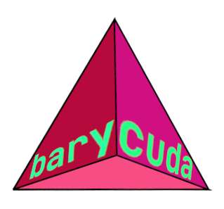

# barycuda


Barycuda is a tiny CUDA accelerated library with no dependencies that
performs various barycentric operations. This is an attempt to speed-up
a 3D renderer that I'm working on.

Currently, the library exposes the following functions:  
* `point_in_simplex` - takes an array of points, the vertices
of a 2D/3D simplex, and tells you if each point lies inside the
simplex.  
* `bary_simplex` - takes an array of points, the vertices of
a 2D/3D simplex, and returns the barycentric coordinates for
each point.

## Build
```bash
# inside the project directory
mkdir build
cd build
cmake ../
make
```

## Usage
Please see `src/testBary.cpp` 

## Contributing
Feel free to add more geometric operations related to
graphics rendering and raytracing.

## References
Shirley, P. (2009) Fundamentals of Computer Graphics  
https://en.wikipedia.org/wiki/Barycentric_coordinate_system  
https://math.stackexchange.com/questions/1226707/how-to-check-if-point-x-in-mathbbrn-is-in-a-n-simplex  
